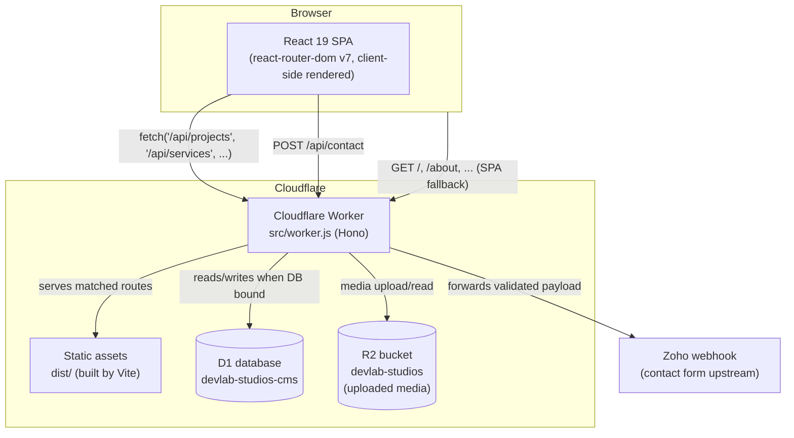

# Architecture

This document describes how the site is actually built and deployed today. For a
list of every tool/library and its version, see [TECH_STACK.md](./TECH_STACK.md).
For known issues and performance findings, see
[../CURRENT_STATE.md](../CURRENT_STATE.md) and
[../performance/PERFORMANCE_FINDINGS.md](../performance/PERFORMANCE_FINDINGS.md).

## System overview

The project is a single Cloudflare Worker that serves both the built static
frontend and the JSON API. There is no separate backend service and no
third-party CMS — the "CMS" is a small custom admin UI backed by Cloudflare D1
and R2.

## Request flow: public pages

1. The browser requests a route (e.g. `/services`). `wrangler.jsonc` configures
   `assets.not_found_handling: single-page-application`, so any path that
   doesn't match a static file in `dist/` falls through to `index.html`.
2. `src/main.jsx` mounts `App.jsx`, which sets up `react-router-dom`'s
   `createBrowserRouter`. Every page component is `React.lazy`-loaded
   (`src/App.jsx`), so only the JS for the visited route is fetched.
3. **Content is rendered twice per page, by design (a hybrid fallback model):**
   - On first render, each page's data hook (e.g. `useServicesContent`,
     `useProfileContent` in `src/hooks/`) returns the hardcoded content from
     `src/data/*.js` immediately via `useMemo` — this is what makes the first
     paint content-complete instead of blank/skeleton.
   - A `useEffect` in the same hook then calls `fetchJsonOnce()`
     (`src/utils/cachedFetch.js`) against the matching Worker endpoint
     (`/api/services`, `/api/profile-content`, etc.).
   - If the Worker responds with `configured: true` (meaning D1 has real rows
     for that content type), the hook swaps in the D1 data and the component
     re-renders with "live" content.
   - If D1 is empty/unbound, the Worker returns `source: 'static-fallback'`
     and the page just keeps showing the bundled static content — no visible
     change.
4. This pattern means **every page does a client-side network round trip after
   first paint**, even though the static fallback prevents a blank screen. See
   [PERFORMANCE_FINDINGS.md](../performance/PERFORMANCE_FINDINGS.md) for the
   performance implications of this.

## Request flow: `/admin`

- `/admin` is a separate lazy-loaded route (`src/pages/Admin.jsx`), built on
  `@refinedev/core` + `@refinedev/simple-rest`, talking to `/api/admin/*`.
- `src/worker/middleware/adminAuth.js` (`requireAdmin`) gates every
  `/api/admin/*` route behind a password-based session check
  (`ADMIN_AUTH_MODE=password` in `wrangler.jsonc`).
- CRUD for projects/services/resources/profile/site-settings/SEO content goes
  through `src/worker/repositories/content.js` and `projects.js`, which run
  parameterized queries against the D1 binding (`c.env.DB`).
- Media (images) uploaded from the admin UI go to the R2 bucket via
  `POST /api/admin/media`; uploads to the `projects` folder are restricted to
  WebP. Public URLs are derived from `R2_PUBLIC_BASE_URL`.
- `/admin*` and `/api/admin/*` are marked `noindex, nofollow` in
  `public/_headers`.

## Contact form flow

`POST /api/contact` (handled in `src/worker.js`, `handleContact`) validates the
payload, applies a simple in-memory per-IP rate limit (5 requests / 10 minutes,
reset on Worker cold start since it's an in-memory `Map`), then forwards the
payload to the `ZOHO_WEBHOOK_URL` configured as a Cloudflare secret/env var
(never exposed to the client — the frontend only ever calls the same-origin
`/api/contact`).

> Note: `functions/api/contact.js` is a legacy Cloudflare Pages Functions
> handler for the same route, left over from before the project moved to a
> single Worker (`wrangler.jsonc` → `main: "src/worker.js"`). It is not part of
> the active deploy path — see [CURRENT_STATE.md](../CURRENT_STATE.md).

## Rendering model

- **100% client-side rendered (CSR).** `index.html` ships an empty
  `
`; there is no SSR or static prerendering step. All
  meta/title tags are set at runtime via `react-helmet-async`
  (`src/components/PageSeo.jsx`) except the base fallback tags baked into
  `index.html` for crawlers that don't execute JS.
- **Code splitting** is route-based (`React.lazy` per page) plus manual vendor
  chunking in `vite.config.js` (`react-vendor`, `router`, `ui-vendor`,
  `helmet`). The admin bundle (Refine + related deps) is isolated to its own
  lazy chunk and never loaded for public visitors.

## Data model

- Static/fallback content: `src/data/*.js` (one file per content domain —
  profile, services, resources, site settings, SEO, portfolio/projects).
- Live content: Cloudflare D1 (`devlab-studios-cms`), schema defined by
  `migrations/0001_cms_foundation.sql` through `0003_expand_resources_feed.sql`.
- Seed data for D1 is generated by `scripts/cms/generate-project-seed.mjs` into
  SQL files applied via `wrangler d1 execute`.

## Deployment

- `wrangler.jsonc` defines the Worker (`main: src/worker.js`), static asset
  binding (`./dist`), D1 binding (`DB`), and R2 binding (`MEDIA_BUCKET`).
- `.github/workflows/ci.yml` runs lint, build, and `npm audit` on every PR/push
  to `main` — it does **not** deploy. Actual deployment is triggered by
  Cloudflare's own Git integration watching the `main` branch (see
  [../guides/PRODUCTION_DEPLOYMENT_GUIDE.md](../guides/PRODUCTION_DEPLOYMENT_GUIDE.md)).
