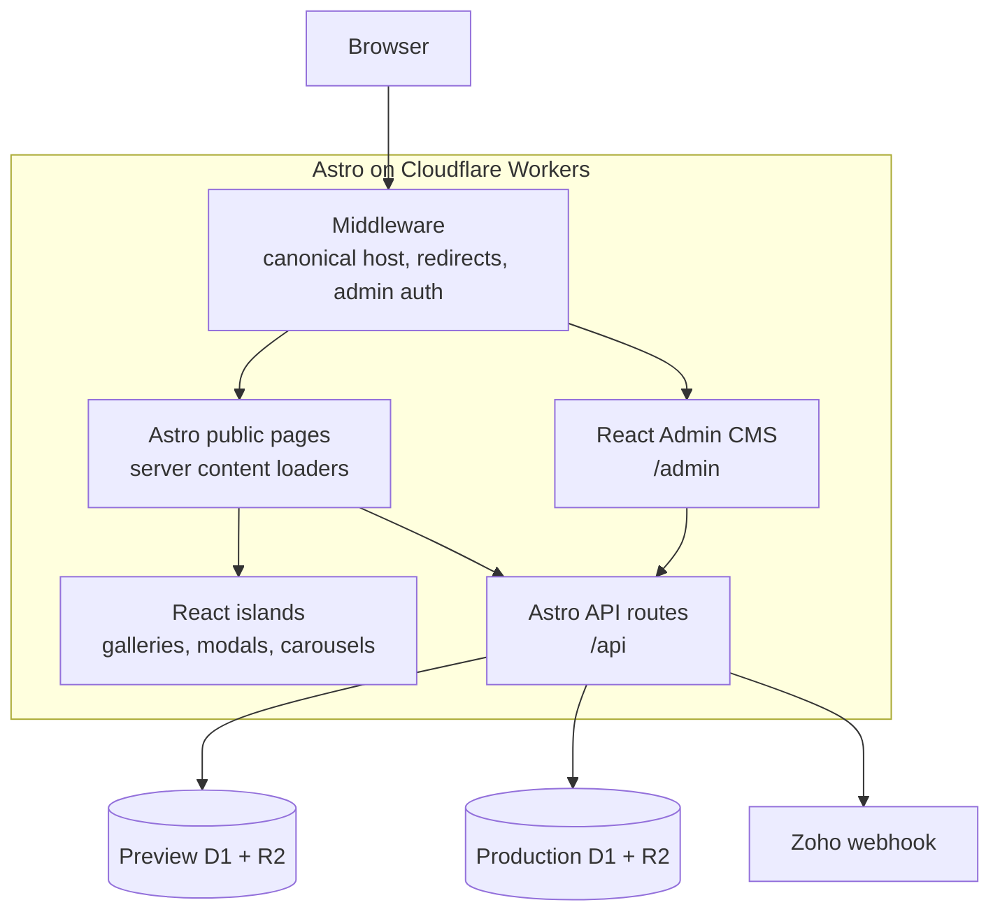
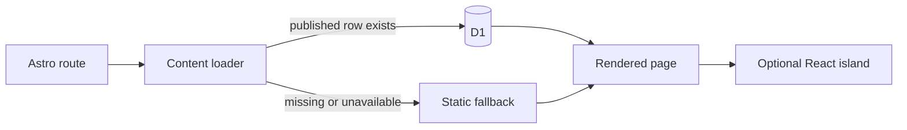

# Architecture

Updated 2026-08-14 for release `1.5.0`.

## System overview

DevLab Studios is one Astro server application deployed as a Cloudflare Worker.
Astro renders public pages and exposes file-based API routes. React is used for
interactive islands, the Admin CMS, and intentionally distinct landing-sample
experiences. D1 stores structured content and operational data; R2 stores media.



The deployment environment determines which D1 database, R2 bucket, public
media base URL, and secrets are baked into the Worker build. Preview and
Production never share storage bindings.

## Rendering model

Normal public routes are `.astro` files under `src/pages/`. Their frontmatter
loads published D1 content on the server through `src/lib/content/*` and falls
back to `src/data/*` when CMS content is absent or a binding is unavailable.
This avoids a blank or broken page during incremental CMS rollout.

Interactive behavior is hydrated only where needed. The five landing samples
remain behind `src/AppIsland.jsx` and `src/pages/[...all].astro` so their
distinct React designs do not complicate the main Astro route system. The Admin
CMS has its own entry at `src/pages/admin/[...path].astro` and React application
under `src/admin-app/`.

## Public content flow



The fallback is a resilience path, not a data synchronization mechanism. Seed
files and static data can drift from existing databases, so operators inspect
real Preview/Production rows before applying targeted updates.

## CMS model

The Admin CMS uses a mix of block-composed singleton pages and structured
collections:

- Home, About, Process, and Work are stored in `pages` and `page_sections`.
- Projects, Services, Articles, Certifications, Testimonials, Case Studies,
  Profile records, redirects, leads, and settings use their dedicated tables or
  site-setting keys.
- Generic validated write paths record content versions and audit events.
- Older bespoke editors retain their established repositories and validation
  until deliberately migrated.

### Work and Projects

Projects are the reusable source for title, technology, links, cover media, and
ordered gallery images. Work stores references to selected Projects and owns
only its curated description, Challenge, System Architecture, Delivery Value,
ordering, and publication state.

Selecting a Project copies its current description once as a starting point.
The Work copy then evolves independently. Public Work rendering resolves live
Project facts and media while retaining the Work narrative. The Project delete
endpoint rejects deletion while any Work item references that Project.

## API layer

Astro file-based endpoints live in `src/pages/api/`:

- public content: projects, services, articles, profile, settings, SEO, and
  health;
- contact: validation, Turnstile, D1 lead persistence, Zoho delivery, and retry;
- admin auth: login, logout, and session inspection;
- admin content: pages, Projects, bespoke content editors, generic collections,
  media metadata/upload, leads, versions, and audit history.

Repositories in `src/worker/repositories/` remain plain functions operating on
the injected D1 binding. The retained `src/lib/honoShim.js` adapts the small
request/context surface used by the established security-reviewed admin auth
module; it does not run a second Hono application.

## Media

R2 is the byte store. A successful upload also attempts to record a
`media_assets` metadata row containing the R2 key, public URL, filename, content
type, size, alt text, and folder. `/admin/media` is a read-only view of that D1
index; an R2 object with no metadata row does not appear there automatically.

Uploads occur in the editor that owns the asset. Work never uploads images;
Project cover and gallery media are managed under Projects and reused by Work.

## Authentication and middleware

`src/middleware.ts` handles canonical-host behavior, D1-backed redirects on real
404s, and the `/api/admin/*` authentication gate. Admin passwords use PBKDF2 and
sessions use signed cookies. Environment secrets are configured in Cloudflare,
never committed to the repository.

Security headers and robots/noindex behavior are applied through the deployed
Astro/Worker response path. Turnstile uses environment-specific site and secret
keys and fails closed when deployed configuration is missing.

## Bindings and environments

Runtime bindings are accessed through the Cloudflare adapter and typed in the
repository environment definitions. Top-level `wrangler.jsonc` configuration is
Production; `env.preview` defines the Preview Worker, D1, R2, and variables.

Because the adapter resolves bindings during `astro build`, Preview builds set
`CLOUDFLARE_ENV=preview` before building. Passing only `--env preview` after a
Production-configured build is too late.

## Deployment

- `development` → GitHub Actions → `devlab-studios-preview`.
- `main` → Cloudflare Workers Builds → `devlab-studios`.

Non-trivial changes are verified locally, promoted to `development`, checked on
the live Preview environment, and only then fast-forwarded to `main`. See
[`../branch-workflow.md`](../branch-workflow.md) and
[`../deployment.md`](../deployment.md).

Code deployment does not promote D1 or R2 data. Remote content changes are
separate targeted operations, Preview first and Production only with a fresh
Cloudflare token.

## Testing

The required pre-push baseline is:

```bash
npm run typecheck
npm run build
npx playwright test --project=static
```

Admin/D1 flows use the local Wrangler environment and dedicated Playwright
coverage. See [`../testing.md`](../testing.md) and [`../operations.md`](../operations.md).

## Rollback

- Roll back Worker code from Cloudflare deployment history.
- Restore versioned CMS content through the Admin version-history flow.
- Correct database structure or data with a new forward migration or targeted
  update; never edit an applied migration or run the destructive full seed on
  an existing database.
