# Architecture

Rewritten 2026-07-31 as part of the Astro/CMS rebuild program (see the
approved plan). This describes the system **as of the end of Phase 1**
(rendering foundation + API port) — Phases 2-6 (schema-driven CMS, full
page conversions, leads backend) will change this further; update this doc
alongside each phase.

## System overview

The project is a single Cloudflare Worker, now built and served by
**Astro** (`output: 'server'`, `@astrojs/cloudflare` adapter) instead of a
hand-written Hono app. D1 and R2 bindings are unchanged from before this
rebuild — no data migration happened, only the rendering/API layer moved.

```mermaid
flowchart TB
    subgraph Browser
        Legacy["Legacy React SPA\n(react-router-dom, wrapped as one\nclient:only island — AppIsland.jsx)"]
    end

    subgraph Astro["Astro (@astrojs/cloudflare adapter)"]
        MW["src/middleware.ts\n(canonical-domain redirect, /api/admin/* auth gate)"]
        Pages["src/pages/index.astro\nsrc/pages/[...all].astro\n(both render LegacyAppShell.astro)"]
        API["src/pages/api/**/*.ts\n(ported from the old Hono worker)"]
    end

    D1[("D1 database\ndevlab-studios-cms")]
    R2[("R2 bucket\ndevlab-studios")]
    Zoho["Zoho webhook"]

    Browser -- "GET any non-API route" --> MW --> Pages
    Pages -- "renders" --> Legacy
    Legacy -- "fetch('/api/*') — still client-side for now" --> MW
    MW -- "/api/admin/* only" --> API
    Browser -- "GET/POST /api/*" --> MW --> API
    API -- "content/projects reads+writes" --> D1
    API -- "media upload" --> R2
    API -- "contact form" --> Zoho
```

## Why it's built this way: the wrap-then-convert strategy

Astro's own migration guide recommends, for exactly this situation
(migrating an existing React SPA), wrapping the whole app as one
client-rendered island first — zero behavior change, immediately deployed
on the new stack — then converting pages to real `.astro` components one
at a time, in production, afterward. Phase 1 is that first step:

- `src/pages/index.astro` and `src/pages/[...all].astro` both render the
  same `src/layouts/shells/LegacyAppShell.astro` component, which mounts
  `<AppIsland client:only="react" />` — the entire legacy `App.jsx`
  (react-router, all pages, `/admin`) unchanged.
- **Two page files, not one**: a `[...all].astro` rest-parameter route does
  **not** match the bare root `/` by default in Astro — it only matches
  paths with at least one segment. `index.astro` explicitly covers `/`.
- The legacy React page components live in `src/legacy-app/pages/` (moved
  out of `src/pages/`, which Astro now treats as its own file-based routing
  directory — leaving them at the old path would make Astro warn on every
  one of them as an "unsupported page file type").
- At Phase 1, every page still fetched its own content client-side via the
  original `src/hooks/use*Content.js` pattern (static fallback → fetch →
  swap). Phase 1 only changed *how the app is served*, not *how it renders
  content* — don't conflate the two when reading this doc.
- **Update (Phase 3, complete):** all 7 real content pages (About, Home,
  Services, Insights, Profile, Contact, plus the 404 page) are now real
  `.astro` routes querying D1 directly in frontmatter via
  `src/lib/content/*.ts` loaders, eliminating the double-render cost
  documented in `../performance/PERFORMANCE_FINDINGS.md`. The `use*Content.js`
  client hooks were deleted alongside each page they powered. What remains
  behind the legacy `client:only` island (`src/AppIsland.jsx`, routed via
  `src/pages/[...all].astro`) is only the 5 `landing-sample-*` demo pages,
  intentionally excluded from conversion — see the comment in
  `[...all].astro` for the up-to-date list. `/admin` moved out of the
  legacy island entirely in Phase 4, onto its own dedicated Astro entry
  (`src/pages/admin/[...path].astro`) with its own `client:only` React
  app (`src/admin-app/`) and internal routing.

## The API layer

Every route from the old `src/worker.js` (Hono) has been ported to Astro's
file-based API convention (`src/pages/api/**/*.ts`), 1:1, same response
shapes, same validation, same rate limiting:

| Old (Hono, deleted) | New |
|---|---|
| `GET /api/health` | `src/pages/api/health.ts` |
| `POST /api/contact` | `src/pages/api/contact.ts` |
| `GET /api/projects` | `src/pages/api/projects.ts` |
| `GET /api/services` \| `/resources` \| `/profile-content` \| `/site-settings` | one file each, sharing `src/lib/publicContent.ts`'s `servePublicContent()` helper for the common "D1 or static-fallback" pattern |
| `GET /api/seo/:pageSlug` | `src/pages/api/seo/[pageSlug].ts` |
| `POST /api/admin/login` \| `/logout` | `src/pages/api/admin/login.ts` \| `logout.ts` |
| `GET /api/admin/session` | `src/pages/api/admin/session.ts`, reads `locals.adminEmail`/etc. set by middleware |
| `GET/PUT /api/admin/content/{services,resources,profile,site-settings,seo}` | one dynamic file, `src/pages/api/admin/content/[type].ts` |
| `GET/POST /api/admin/projects`, `GET/PUT/PATCH/DELETE /api/admin/projects/:id` | `src/pages/api/admin/projects/index.ts` + `[id].ts` |
| `POST /api/admin/media` | `src/pages/api/admin/media.ts` |
| `app.use('*', ...)` canonical redirect + `app.use('/api/admin/*', requireAdmin)` | both moved into `src/middleware.ts` |

**New in Phase 4** (no Hono precedent — these didn't exist before the
admin rebuild): `GET /api/admin/media` (list, alongside the existing
upload `POST`), `GET/PUT /api/admin/collections/[type]` +
`DELETE /api/admin/collections/[type]/[id]` (generic replace-all/per-item
collection CRUD, Zod-validated), `GET /api/admin/versions/[type]` +
`POST /api/admin/versions/[type]/rollback`, `GET /api/admin/audit-log`,
`GET/PUT /api/admin/pages/[slug]` (block-composed pages). See
`docs/content-model.md` for what each actually does.

**The underlying business logic didn't move or change** —
`src/worker/repositories/content.js`, `projects.js`, `utils/responses.js`
are imported into the new `.ts` route files unchanged, since they were
already plain functions taking `db`/`env` as arguments, not Hono-coupled.

**The one deliberately-reused-unchanged piece**: `src/worker/middleware/adminAuth.js`
(PBKDF2 password verification, HMAC session cookie signing) is
security-critical, so rather than rewrite it against Astro's request
model, `src/lib/honoShim.js` provides a minimal object matching the subset
of Hono's context (`c.req.header()`, `c.req.json()`, `c.env`, `c.set()`)
that `handleAdminLogin`/`handleAdminLogout`/`requireAdmin` actually call.
This lets that code run byte-for-byte identical to before. **Update
(Phase 4):** the shim stayed — `adminAuth.js`/`honoShim.js` are unchanged,
and every new Phase 4 admin route (`api/admin/collections/*`,
`api/admin/versions/*`, `api/admin/pages/*`) is gated by the same
`requireAdmin` call in `src/middleware.ts` as everything else under
`/api/admin/*`. Turned out not to need an Astro-native rewrite — the
bridge was a fine permanent home for this, not just a migration
stopgap.

## Bindings

Accessed via `import { env } from 'cloudflare:workers'` (the adapter's
current convention, replacing Hono's `c.env`), wrapped by
`src/lib/env.ts`'s `getEnv(): Env` for a typed accessor
(`src/env.d.ts` declares the `Env` interface matching `wrangler.jsonc`'s
bindings). Same D1 database (`devlab-studios-cms`) and R2 bucket
(`devlab-studios`) as before — untouched by this rebuild so far.

## Deployment

`wrangler.jsonc`'s `main` now points at
`@astrojs/cloudflare/entrypoints/server` (the adapter's own entry) instead
of a hand-written file. Two config details that silently break in SSR mode
if left as they were for the old static SPA:

- `assets.not_found_handling: "single-page-application"` → changed to
  `run_worker_first: true`. The SPA-fallback setting tries to serve
  `index.html` for unmatched paths, but there is no static `index.html`
  in SSR mode — every request 404'd at the assets layer before ever
  reaching Astro's router.
- `main` pointing at the old `src/worker.js` caused the adapter to merge/
  wrap that legacy Hono app ahead of Astro's own router, so requests were
  fully handled (and 404'd) by the old app before Astro ever saw them.

Local dev note: `astro dev`'s live SSR pipeline hits a known upstream bug
in this Astro/`@astrojs/cloudflare` version combination ("Missing field
`moduleType`"). Use `astro build && astro preview` for local
testing/E2E instead — it runs the real `workerd` runtime via the built
output and works correctly. `npm run dev` is left pointing at `astro dev`
for hot-reload during page conversion work where it does function (the bug
appears to specifically affect the earliest cold-start dependency
optimization pass), but don't rely on it for anything requiring a full
clean start.

## Testing

`tests/e2e/*.spec.js` (Playwright) run against `astro build && astro
preview` (`public-pages.spec.js`, `contact-form.spec.js`) and `wrangler dev
--local` (`admin.spec.js`, exercising the real ported auth + D1 CRUD path).
See `docs/operations.md` for local environment setup
(`.dev.vars`, D1 migrations).
